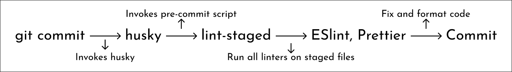

Why we need LintStage / EsLint /  Husky
---

LintStage, ESLint, and Husky are tools that are often used together in JavaScript and TypeScript projects to maintain code quality. Here's why:

<!-- pause -->

## ESLint

This is a tool for identifying and reporting on patterns found in ECMAScript/JavaScript code. It's highly configurable and can help catch errors and enforce a consistent coding style. It can be integrated into your editor/IDE, and can be part of your continuous integration pipeline.

<!-- pause -->

## Lint-staged

This is a library that is used to run linters on staged files (files that are about to be committed) in git. It's often used with ESLint to ensure that only files that pass linting are committed. This helps prevent bad or error-prone code from being committed to the repository.

<!-- pause -->

## Husky

This is a tool that makes it easy to use git hooks, which are scripts that git executes before or after events such as commit, push, and so on. Husky is often used with lint-staged to automatically run linters before commits are allowed.

<!-- pause -->

_**In summary these tools are used together to automatically enforce code quality rules at various points in the development workflow, such as before committing or pushing code. This helps catch and fix issues early, and ensures that only code that meets the project's quality standards is committed.**_

<!-- pause -->



<!-- end_slide -->

Lint Stage
---

LintStage is a Node.js module that runs linters against staged git files and checks for formatting errors.

<!-- pause -->

## Install Dependencies

```bash
pnpm install -D lint-staged husky
```

<!-- pause -->

## Configuration

after installing the packages, we need to add the configuration, it can be added to the `package.json` file but I will create a seperate file for it.

<!-- pause -->

```bash
echo .lintstagedrc.js
```

<!-- pause -->

```javascript
const path = require('path');

const buildEslintCommand = (filenames) =>
  `next lint --fix --file ${filenames.map((f) => path.relative(process.cwd(), f)).join(' --file ')}`;

module.exports = {
  '*.{js,jsx,ts,tsx}': [buildEslintCommand, 'pnpm run prettier'],
  '*.{json,md}': ['prettier --write'],
};
```

<!-- pause -->

to run it we need to add a script to the `package.json` file.

<!-- pause -->

```json
{
  "scripts": {
    "lint.staged": "lint-staged"
  }
}
```

<!-- end_slide -->

Husky Configuration
---

to configure husky to run the lint-staged before the commit, we need to run the following command.

<!-- pause -->

## Install Dependencies

```bash
pnpm exec husky init
```

<!-- pause -->

## Configuration

after running the command, husky will create a `.husky` folder with a `pre-commit` file, we need to modify the file to run the lint-staged.

<!-- pause -->

```bash
echo .husky/pre-commit
```

<!-- pause -->

```bash
#!/bin/sh
. "$(dirname "$0")/_/husky.sh"

pnpm run lint-staged
```

now we can commit the changes and see the lint-staged in action 🚀.

<!-- end_slide -->

Eslint Configuration
---

Eslint is a tool for identifying and reporting on patterns found in ECMAScript/JavaScript code, with the goal of making code more consistent and avoiding bugs.

it's already come with the next.js, but we need to add some configuration to it configuration to handle

* Typescript issues
<!-- pause -->
* Import issues
<!-- pause -->
* JSX issues
<!-- pause -->
* Prettier issues
<!-- pause -->
* and more

<!-- pause -->

## Install Dependencies

```bash
pnpm install -D eslint-plugin-import eslint-plugin-jsx-a11y eslint-plugin-prettier @typescript-eslint/eslint-plugin
```

<!-- pause -->

## Configuration

then append the configuration to the `.eslintrc.json` file

```json
{
  "extends": [
    "next/core-web-vitals",
    "plugin:import/errors",
    "plugin:import/warnings",
    "plugin:import/typescript",
    "plugin:@typescript-eslint/recommended",
    "prettier",
    "plugin:jsx-a11y/recommended"
  ],
  "plugins": ["import", "@typescript-eslint", "prettier", "jsx-a11y"],
  "rules": {
    "import/order": [
      "error",
      {
        "groups": [
          "builtin",
          "external",
          "internal",
          "parent",
          "sibling",
          "index"
        ],
        "newlines-between": "always"
      }
    ],
    "import/newline-after-import": "error",
    "import/no-duplicates": "error",
    "import/no-commonjs": "error",
    "@typescript-eslint/no-unused-vars": [
      "error",
      { "vars": "all", "args": "after-used", "ignoreRestSiblings": false }
    ],
    "@typescript-eslint/no-unused-expressions": "error",
    "no-unused-vars": "off",
    "no-console": "warn",
    "no-eval": "error",
    "curly": "error",
    "prettier/prettier": "error",
    "jsx-a11y/accessible-emoji": "error",
    "no-magic-numbers": ["error", { "ignore": [0, 1] }]
  }
}
```

<!-- end_slide -->

Outro
---

In this lesson, we learned about LintStage, ESLint, and Husky, and how they can be used together to maintain code quality in JavaScript and TypeScript projects. We saw how to install and configure these tools, and how they can be used to automatically enforce code quality rules at various points in the development workflow.

<!-- pause -->

In the next lesson, we'll learn about CSS Styling in Nextjs.  🚀
